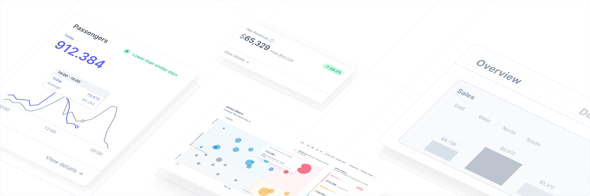

<br>
<br>
<br>
<div align="center">
  
<br>
<br>
<br>

  <div align="center"'>
    <a href="#">
      
    </a>
    <a href="https://www.npmjs.com/package/@tremor/react">
        
    </a>
    <a href="https://twitter.com/tremorlabs">
      
    </a>
    <a href="#">
      
    </a>
    <a href="https://github.com/tremorlabs/tremor/blob/main/License">
      
    </a>
  </div>

<br>

  <h1>The react library to build dashboards fast</h1>

</div>

[Tremor](https://tremor.so/) lets you create simple and modular components to build insightful dashboards in a breeze. Fully open-source, made by data scientists and software engineers with a sweet spot for design.

<br>
<br>



<br>
<br>

## Getting started

To get started with tremor, follow these steps:

1. Create a react app
    ```bash
    npx create-react-app my-app
    cd my-app
    ```

2. Install tremor using NPM

    ```bash
    npm install @tremor/react
    ```

**💡 Hint:** If you want to see how you can build your first dashboard, have a look at our [documentation](#).
<br>
<br>

## Example

With tremor creating an analyticl interface is easy.
<br>
<br>

Card.tsx
```jsx
// example of component composition

import { Card, Title, Metric, Text, Bold, ProgressBar } from "@tremor/react";

<Card>
    <Title title="Ticket Sales"/>
    <Metric value="$ 71,465"/>
        <Flex>
            <Text><Bold>32%</Bold>of annual target</Text>
            <Text>$ 223,328</Text>
        </Flex>
    <ProgressBar widthPercentage="32%"/>
</Card>
```
<br>


<br>

## Community and Contribution

We are always looking for new ideas or other ways to improve tremor. If you have developed anything cool or found bug, send us a pull request.
<br>
<br>

## License

[Apache License 2.0](https://github.com/tremorlabs/tremor/blob/main/License)

Copyright (c) 2022 Tremor.