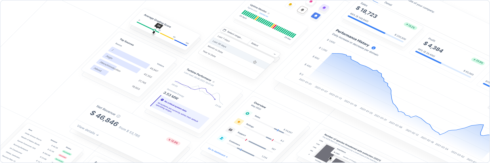

<br>
<br>
<br>
<div align="center">
  
<br>
<br>
<br>

  <div align="center">
    <a href="https://www.npmjs.com/package/@tremor/react">
      
    </a>
    <a href="https://tremor.so/docs/getting-started/introduction">
      
    </a>
    <a href="https://github.com/tremorlabs/tremor/blob/main/License">
      
    </a>
    <a href="https://twitter.com/intent/follow?screen_name=tremorlabs">
      
    </a>
  </div>
  <h3 align="center">
    <a href="https://www.tremor.so/docs/getting-started/installation">Documentation</a> &bull;
    <a href="https://demo.tremor.so/">Demo Dashboard</a> &bull;
    <a href="https://www.tremor.so">Website</a>
  </h3>

<br>

  <h1>The react library to build dashboards fast</h1>

</div>

[Tremor](https://tremor.so/) lets you create simple and modular components to build insightful dashboards in a breeze. Fully open-source, made by data scientists and software engineers with a sweet spot for design.

<br>
<br>



<br>
<br>

## Getting Started

You can use tremor either within a [React](https://reactjs.org/) or [Next.js](https://nextjs.org) Project.
For new projects, we recommend using Next.js, as it also provides a simple deployment workflow through the [Vercel](https://vercel.com/docs) platform.

<br>

## Option A: Using Create React App

In your terminal, we create a new React project:

```bash
npx create-react-app my-project --template typescript
cd my-project
```
*Using the `--template typescript` option is optional here.*

<br>

Install tremor from your command line via npm.

```bash
npm install @tremor/react
```

<br>

Import the tremor stylesheet into the `App.js` / `App.tsx`  file:
```tsx
import '@tremor/react/dist/esm/tremor.css';
```
*Note, if you are importing other CSS files along with `tremor.css`, make sure to add the above import statement as the last one, in order to avoid unintentional CSS conflicts.*
<br>

Finally, run the dev server.
```bash
npm start
```

<br>


## Option B: Using NextJS 
**⚠️ Note:** Since we have not fully migrated to Next.js 13 yet, if you are using the `app` directory introduced in Next.js 13, wrap your tremor components in another component by using the `"use client"` directive. More infos on the directive and the usage of third-party libraries in Next.js 13 can be found in the [Next.js docs](https://beta.nextjs.org/docs/rendering/server-and-client-components#third-party-packages).

In your terminal, we create a new Next project:

```bash
npx create-next-app my-project --typescript
cd my-project
```
*Using the `--typescript` option is optional here.*

<br>

Install tremor from your command line via npm.

```bash
npm install @tremor/react
```

<br>

Import the tremor stylesheet into the `_app.js` / `_app.tsx`  file:

```bash
import '@tremor/react/dist/esm/tremor.css'
```
*Note, if you are importing other CSS files along with `tremor.css`, make sure to add the above import statement as the last one, in order to avoid unintentional CSS conflicts.*
<br>

Finally, run the dev server

```bash
npm run dev
```
<br>
<br>

**💡 Hint:** Since we are in beta, please be aware that there might be breaking changes in the future. If you want to see how you can build your first dashboard, have a look at our [documentation](https://tremor.so/docs/getting-started/demo-dashboard).

<br>

## Example

With tremor creating an analytical interface is easy.
<br>
<br>

```jsx
//Card.tsx
import { Card, Text, Metric, Flex, ProgressBar } from "@tremor/react";

export default () => (
  <Card maxWidth="max-w-sm">
    <Text>Sales</Text>
    <Metric>$ 71,465</Metric>
    <Flex marginTop='mt-4'>
        <Text>32% of annual target</Text>
        <Text>$ 225,000</Text>
    </Flex>
    <ProgressBar percentageValue={ 32 } marginTop="mt-2" />
  </Card>
);
```
<br>


<br>

## Community and Contribution

We are always looking for new ideas or other ways to improve tremor. If you have developed anything cool or found a bug, send us a pull request.
<br>
<br>

## License

[Apache License 2.0](https://github.com/tremorlabs/tremor/blob/main/License)

Copyright &copy;  2022 Tremor. All rights reserved.
